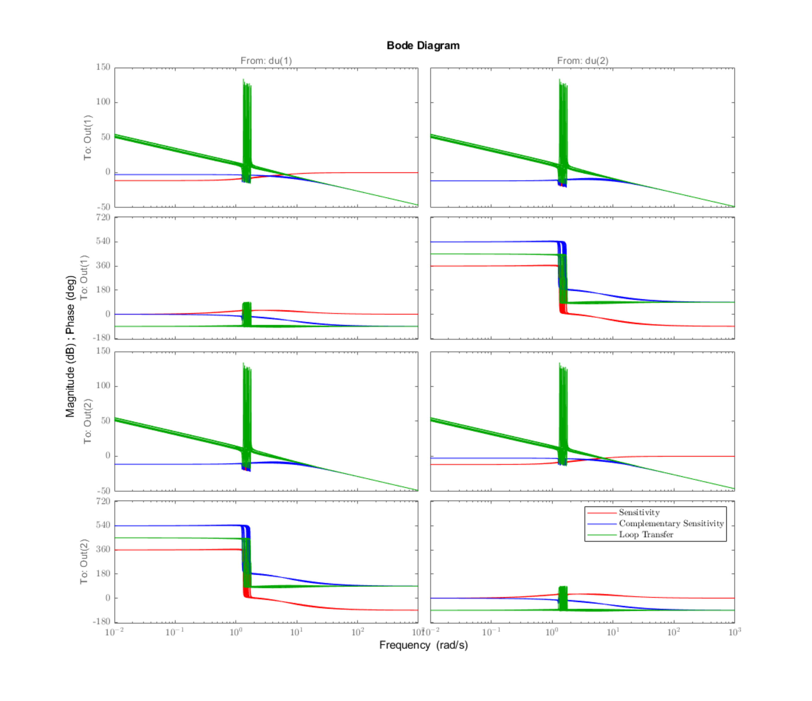
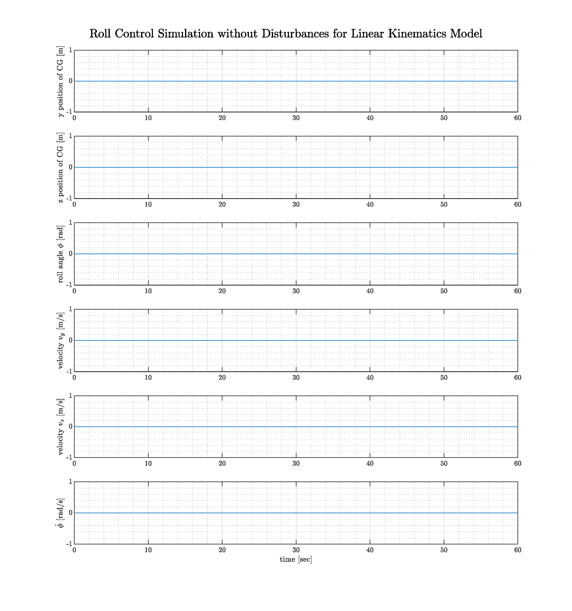
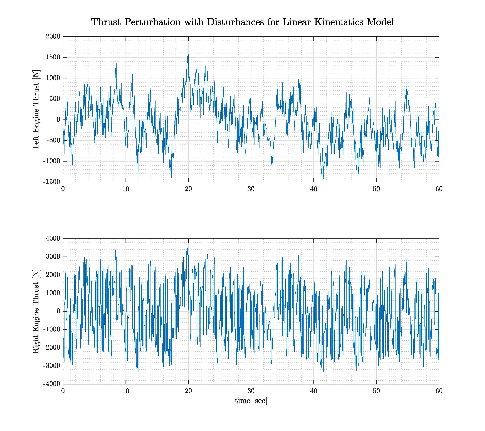
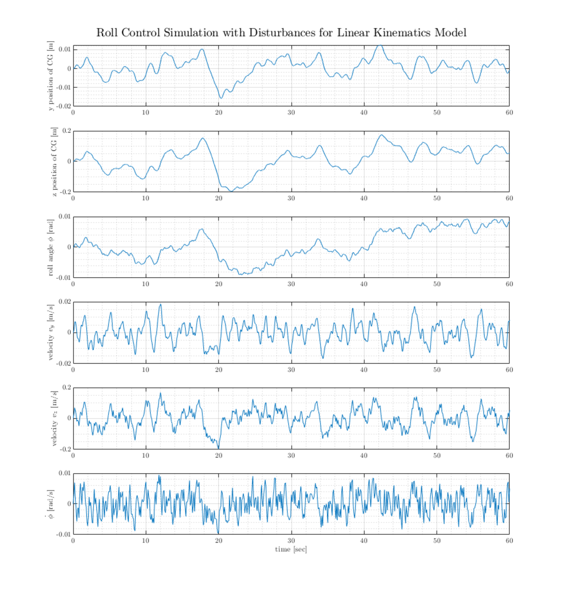
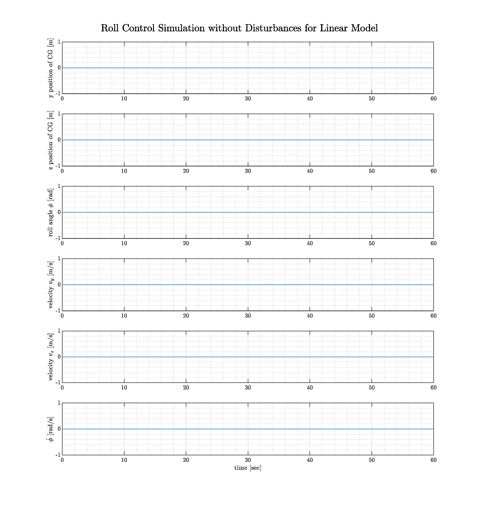
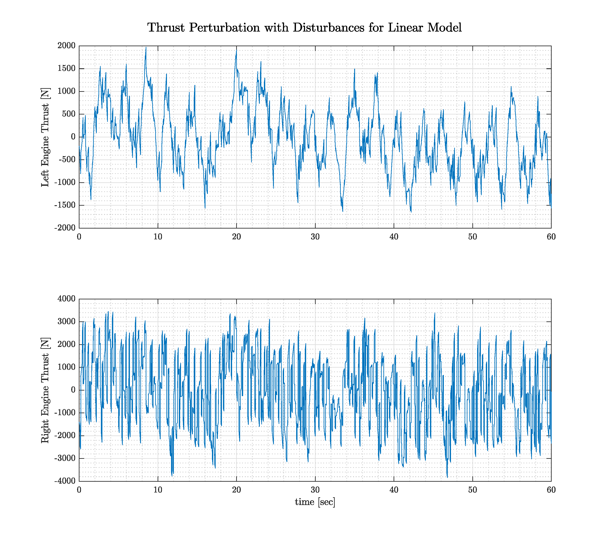
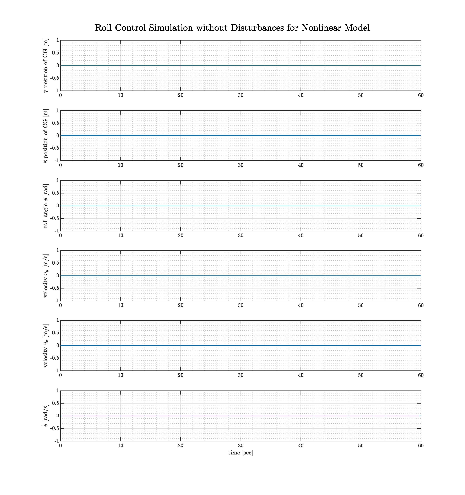
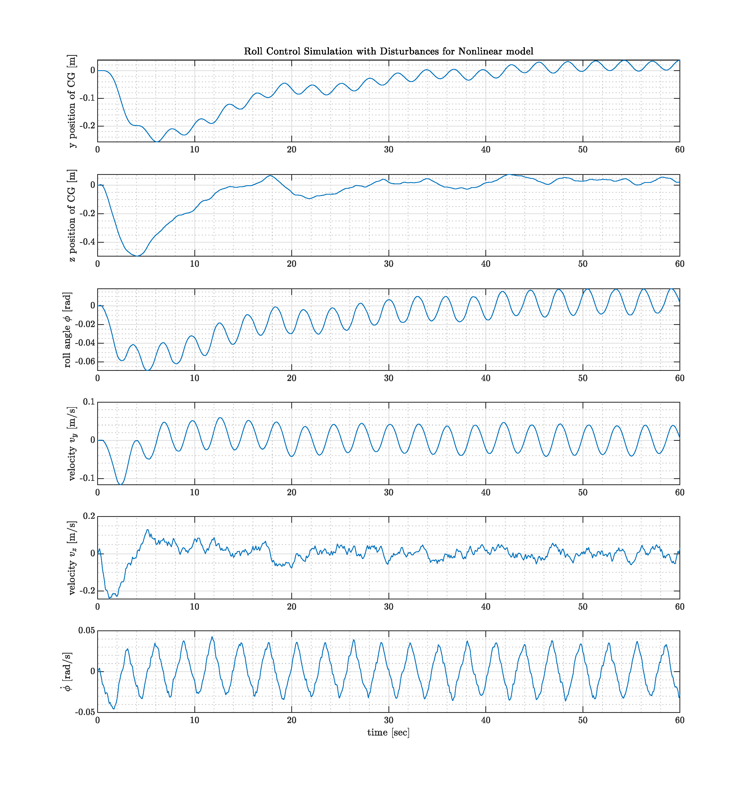

# AAE 451 Senior Design: Hover Roll Control 


 Author: Tomoki Koike


# Kinematics Model Problem Formulation


> **Fig. 1.**


  


The intial step is to model the dynamical system. In order to do this we will consider the translational motion in the y and z direction as well as the rotational motion along the longitudinal axis. Keeping in the mind that the translational motion is with respect to the center of gravity (CG) we can formulate the system equations as follows.


  


Let the inputs for this system be 


Now we can rewrite the equation as 


Defining the output as 


  
## Linearization Analysis


First we will analyze this system by linearizing the system and checking the eigenvalues of the system matrix. 


Let the equilibrium conditions be,


and the linearization process is as follows 


This becomes 


The system matrix becomes


For this system we can see that 


The linear system is shown to be proven, however, the nonlinear system is undetermined due to the eigenvalue at the origin. We will add some more parameters to stabilize the control matrix. 


  
### Introduction of Flexural Rigidity for z-direction


Also we introduce the flexural rigidity constant into the system equation by approximating the wing to be a cantilever beam.


> **Fig 2.**


  
  


Where we define 


where  is the wing span and  is the wing loading, and  is the gravitational acceleration. Thus,


  


This alters the linearized system equation to become 


The system matrix for the linearized system becomes


For this system we can see that the eigenvalues become 


```matlab:Code
syms c_y c_z m k
A = [0 0 0 1 0 0;
     0 0 0 0 1 0;
     0 0 0 0 0 1;
     0 0 0 -c_y/m 0 0;
     0 -k/m 0 0 -c_z/m 0;
     0 0 0 0 0 0];

eig(A);
```

ans = 

   
  

$$\left(\begin{array}{c}
0\\
0\\
0\\
-\frac{0.5000\,\left(c_z -\sqrt{{c_z }^2 -4\,k\,m}\right)}{m}\\
-\frac{c_y }{m}\\
-\frac{0.5000\,\left(c_z +\sqrt{{c_z }^2 -4\,k\,m}\right)}{m}
\end{array}\right)$$


The nonnegative eigenvalues (0) makes this system not stabilizable or detectable. Thus, we add one more parameter which is the rotation damping parameter .


  
### Adding Rotational Damping 


Then the nonlinear system equations will become 


The corresponding linear system matrix becomes 


```matlab:Code
syms c_y c_z m k c_phi J_x_x k_phi
A = [0 0 0 1 0 0;
     0 0 0 0 1 0;
     0 0 0 0 0 1;
     0 0 0 -c_y/m 0 0;
     0 -k/m 0 0 -c_z/m 0;
     0 0 0 0 0 -c_phi/J_x_x];

eig(A);
```

ans = 

   


The eigenvalues are 


$$\left(\begin{array}{c}
0\\
0\\
-\frac{0.5000\,\left(c_z -\sqrt{{c_z }^2 -4\,k\,m}\right)}{m}\\
-\frac{c_{\phi } }{J_{x,x} }\\
-\frac{c_y }{m}\\
-\frac{0.5000\,\left(c_z +\sqrt{{c_z }^2 -4\,k\,m}\right)}{m}
\end{array}\right)$$

  


If we think of a critically damped case for a simple mass spring damper system, it is ideal to have the relation


and considering transient response characteristics we know that 


which gives us 


now for an optimal response we would like to assume that , and therefore


We will also assume that 


  
### Observability, Controlability, Detectability, Stabilizability Analysis

\hfill \break


```matlab:Code
% Housekeeping commands
clear all; close all; clc;
```


```matlab:Code
%%%%%%%%%%%%%%%%%%%%%%%%%%%%  RUN THIS! %%%%%%%%%%%%%%%%%%%%%%%%%%%%%
% Read all the data necessary

addpath("../../../parameters/");
addpath("../sizing_code/");

% Load the excel sheet in the parameters folder to obtain constants 
T1 = readtable("catiaMeas.xlsx","Sheet","OGWingPosition");
```


```text:Output
Warning: Column headers from the file were modified to make them valid MATLAB identifiers before creating variable names for the table. The original column headers are saved in the VariableDescriptions property.
Set 'VariableNamingRule' to 'preserve' to use the original column headers as table variable names.
```


```matlab:Code
S = readJSON2struct("output.json");
T2 = readtable("controlParameters.xlsx");
```


```matlab:Code
%%%%%%%%%%%%%%%%%%%%%%%%%%%%  RUN THIS! %%%%%%%%%%%%%%%%%%%%%%%%%%%%%
consts.g = 9.81;  % gravitational acceleration 
consts.m = T1.Mass_kg_(8);  % mass of the aircraft
```


```matlab:Code
%%%%%%%%%%%%%%%%%%%%%%%%%%%%  RUN THIS! %%%%%%%%%%%%%%%%%%%%%%%%%%%%%
consts.WS = S.PerformanceInputs.WS;  % wing loading of the aircraft 
consts.Iyy = T1.IoyG_kgxm2_(8);  % y direction principal moment of inertia
consts.l = 0.5*(T2.Var2(1) + T2.Var2(8));  % arm length of engine from long axis
consts.b = S.GeometryOutput.b;  % wing span

% Flexural rigidity
consts.k = 3 * consts.g * consts.WS * consts.Iyy / (consts.b)^3 / 8;

% Estimated damping coefficients in the y and z direction
consts.cz = 2 * sqrt(consts.m * consts.k);
consts.cy = 2 * cosd(5) * sqrt(consts.m * consts.k);

% Obtain moment of inertias 
consts.Ixx = T1.IoxG_kgxm2_(8);
consts.Iyy = T1.IoyG_kgxm2_(8);
consts.Izz = T1.IozG_kgxm2_(8);
consts.Jxx = consts.Iyy + consts.Izz;
```


We linearize the system about 


Let


Thus, 


```matlab:Code
%%%%%%%%%%%%%%%%%%%%%%%%%%%%  RUN THIS! %%%%%%%%%%%%%%%%%%%%%%%%%%%%%
% Create the matrices 
m = consts.m;
g = consts.g;
l = consts.l;
Jxx = consts.Jxx;
k = consts.k;
cy = consts.cy;
cz = consts.cz;

% temporarily define cphi
% This will be reconsidered in the uncertain parameter modelling in a later
% section
cphi = 5*Jxx;
consts.cphi = cphi;
```


```matlab:Code
% Control matrices
A = [0 0 0 1 0 0;
     0 0 0 0 1 0;
     0 0 0 0 0 1;
     0 0 0 -cy/m 0 g;
     0 -k/m 0 0 -cz/m 0;
     0 0 0 0 0 -cphi/Jxx];

B = [0 0; 0 0; 0 0; 0 0; -1/m -1/m; l/Jxx -l/Jxx];
% Assume we can only measure y, z, and phi
C = [1 0 0 0 0 0;
     0 1 0 0 0 0;
     0 0 1 0 0 0];
D = zeros(size(C, 1), size(B, 2));
```


Now check the observability 


```matlab:Code
kore = checkObservability(A,C);
```


The structure output "res.check" = 1. This shows that this system is observable. This also means that the system is detectable. 


Now check the controllability 


```matlab:Code
kore = checkControllability(A,B);
rref(kore.Qc);
```


The structure output "res.check" = 0. This shows that this system is not controllable.


Now check the stabilizability 


```matlab:Code
kore = find_unctrb_eigVal(A,B);
```


This system is not stabilizable which is a critical condition for our controller design. 


Thus, we will add a final parameter to make this system controllable and stabilizable. That is a  value that will be set to be an uncertain parameter. The system equation and matrices will end up being


The linearized model about  is


Let


Thus, 


```matlab:Code
%%%%%%%%%%%%%%%%%%%%%%%%%%%%  RUN THIS! %%%%%%%%%%%%%%%%%%%%%%%%%%%%%
consts.kz = k;

% Set an arbitrary value 
% This value will be reconsidered in the uncertain parameter modelling
% using a robust control technique later
consts.ky = m*2.4; 

A = [0 0 0 1 0 0;
     0 0 0 0 1 0;
     0 0 0 0 0 1;
     -consts.ky/m 0 0 -cy/m 0 g;
     0 -consts.kz/m 0 0 -cz/m 0;
     0 0 0 0 0 -cphi/Jxx];

rank(ctrb(A,B))  % controllable
```


```text:Output
ans = 6
```

## Uncertain Parameter Model


The approach we are going to use is going to account for uncertainty and implement  an uncertain parameter model [1].


```matlab:Code
% uncertain parameters
uconsts.ky = ureal('ky', consts.ky, 'percent', 30);
uconsts.cy = ureal('cy', consts.cy, 'percent', 30);
uconsts.cphi = ureal('cphi', consts.cphi, 'percent', 30);
```


```matlab:Code
% System matrices
uA = [0 0 0 1 0 0;
     0 0 0 0 1 0;
     0 0 0 0 0 1;
     -uconsts.ky/m 0 -uconsts.cy/m 0 0 0;
     0 -consts.kz/m 0 0 -consts.cz/m 0;
     0 0 0 0 0 -uconsts.cphi/Jxx];

uB = [0 0; 0 0; 0 0; 0 0; -1/m -1/m; l/Jxx -l/Jxx];
% Assume we have full state feedback
uC = eye(6);
uD = zeros(size(uC, 1), size(uB, 2));
```


```matlab:Code
usys = ss(uA,uB,uC,uD);
% Create a temporary feedback controller using pole placement
p = [-1.31, -1.31, -2, -2.5, -5, -8];
uK = place(A,B,p);
usys_fb = feedback(usys, uK);
```


```matlab:Code
% Get the Robust stability margins 
opt = robOptions('Display','on','Sensitivity','on');
[StabilityMargin,wcu] = robstab(usys_fb,opt);
```


```text:Output
Computing peak...  Percent completed: 100/100
System is robustly stable for the modeled uncertainty.
 -- It can tolerate up to 244% of the modeled uncertainty.
 -- There is a destabilizing perturbation amounting to 303% of the modeled uncertainty.
 -- This perturbation causes an instability at the frequency 0 rad/seconds.
 -- Sensitivity with respect to each uncertain element is:              
      18% for cphi. Increasing cphi by 25% decreases the margin by 4.5%.
      11% for cy. Increasing cy by 25% decreases the margin by 2.75%.   
      0% for ky. Increasing ky by 25% decreases the margin by 0%.       
```


```matlab:Code
% Get the worst case peak gains 

Swc = usubs(usys_fb,wcu);
getPeakGain(Swc)
```


```text:Output
ans = 2.4486e+05
```


```matlab:Code
% Sensitivity functions of plant-controller feedback loop
loops = loopsens(usys,uK); 
fig = figure("Renderer","painters","Position",[60 60 1100 950]);
bode(loops.Si,'r',loops.Ti,'b',loops.Li,'g')
legend('Sensitivity','Complementary Sensitivity','Loop Transfer')
```





```matlab:Code
% VERY HEAVY TO RUN - SO YOU CAN SKIP THIS STEP

% fig = figure("Renderer","painters","Position",[60 60 1300 750]);
% bode(loops.So,'r',loops.To,'b',loops.Lo,'g')
% legend('Sensitivity','Complementary Sensitivity','Loop Transfer')
```


Based on the Robust stability margins we will increment the  value by 25% and  value by 25% to improve the system performance.


```matlab:Code
consts.cphi = consts.cphi * 1.249;
consts.cy = consts.cy * 1.249;
```

# Kinematics Model Controller Design 


For this system, since we cannot measure the velocities and angular velocities of the states we will implement a LQG controller which is a combination of a LQE and LQR controller. The LQE is bascially a Kalman Filter (KF). Adding a PID controller that we could may inherit from our first design seems to be a robust control method [3]. However, to not overcomplicate the controller we will keep it as a LQG controller.


## LQR Controller


Next we build that actual LQR controller with given parameters 


```matlab:Code
cy = consts.cy;
cz = consts.cz;
cphi = consts.cphi;
ky = consts.ky;
kz = consts.kz;
Tmax = T2.Var2(7);  % max thrust of our given engine
consts.Tmax = Tmax; 

% Control matrices
A = [0 0 0 1 0 0;
     0 0 0 0 1 0;
     0 0 0 0 0 1;
     -ky/m 0 0 -cy/m 0 g;
     0 -kz/m 0 0 -cz/m 0;
     0 0 0 0 0 -cphi/Jxx];

B = [0 0; 0 0; 0 0; 0 0; -1/m -1/m; l/Jxx -l/Jxx];
C = eye(6);
D = zeros(size(C, 1), size(B, 2));
sys = ss(A, B, C, D);
```


```matlab:Code
% Build LQR controller 
% Q = diag([150 250 200 130 250 160]);  % default  
% Q = diag([120 230 200 70 150 90]);  % * 100
% Q = diag([190 230 260 200 300 210]);  % / 100
% Q = diag([160 220 230 130 250 160]);  % good one
% Q = diag([160 120 230 130 150 160]);
Q = diag([160 469 230 140 620 220]);   % current
% Q = diag([210 150 230 170 180 130]);
R = diag([1/Tmax/10 1/Tmax/10]);
Klqr = lqr(sys.A, sys.B, Q, R);
```

## Continous-Time Kalman Filter 

```matlab:Code
% Build KF assuming we can only measure y, z, and phi
Ckf = [1 0 0 0 0 0;
       0 1 0 0 0 0;
       0 0 1 0 0 0];
Dkf = zeros(size(Ckf, 1), size(B, 2));

Vd = 70 * diag([3 3 5 1 1 5]);
Vn = 50 * eye(3);
[Kf, P, E] = lqe(A, Vd, Ckf, Vd, Vn);
sysKF = ss(A - Kf*Ckf, [B Kf], eye(6), 0*[B Kf]);
```

# Kinematics Model Simulation

```matlab:Code
% Some inputs for the simulation 
Vwind_ul = 21.35;  % Upper limit for wind velocity above sea 45 kts
Vwind_ll = -21.35;  % Lower limit for wind velocity above sea -45 kts

% Equilibrium conditions
ye = 0;
ze = 0;
phie = 0;
ydote = 0;
zdote = 0;
phidote = 0;
u1e = m*g/2;
u2e = u1e;
```


```matlab:Code
% Settings for better looking plots
set(groot, 'defaulttextinterpreter','latex');
set(groot, 'defaultAxesTickLabelInterpreter','latex');
set(groot, 'defaultLegendInterpreter','latex');
```

## Linearized Model
### Simulate without disturbance 

\hfill \break


```matlab:Code
noise_on = -1;  % turn on/off noise
disturbance_on = -1;  % turn on/off disturbance
simout = sim("vtol_roll_kin_lin.slx");  % Run simulation 
```


```matlab:Code
% Obtain values from simulation
t = simout.tout;  % time span
res.Doff.Fl = simout.Fleft.signals.values;  % Thrust from left engine
res.Doff.Fr = simout.Fright.signals.values;  % Thrust from right engine
res.Doff.y = simout.xstates.signals.values(:,1);  % y values
res.Doff.z = simout.xstates.signals.values(:,2);  % z values
res.Doff.phi = simout.xstates.signals.values(:,3);  % phi values
res.Doff.ydot = simout.xstates.signals.values(:,4);  % ydot values
res.Doff.zdot = simout.xstates.signals.values(:,5);  % zdot values
res.Doff.phidot = simout.xstates.signals.values(:,6);  % phidot values 
```


```matlab:Code
% Plot Thrust
fig = figure("Renderer","painters","Position",[60 60 900 800]);
    subplot(2,1,1)
    plot(t, res.Doff.Fl)
    grid on; grid minor; box on;
    ylabel('Left Engine Thrust [N]')
    subplot(2,1,2)
    plot(t, res.Doff.Fr)
    grid on; grid minor; box on;
    ylabel('Right Engine Thrust [N]')
    xlabel('time [sec]')
    title_string = 'Negative Feedback Thrust without Disturbances for Linear Kinematics Model';
    sgtitle(title_string)
```


```matlab:Code
% Plot Thrust
fig = figure("Renderer","painters","Position",[60 60 900 960]);
    subplot(6,1,1)
    plot(t, res.Doff.y)
    grid on; grid minor; box on;
    ylabel('y position of CG [m]')
    subplot(6,1,2)
    plot(t, res.Doff.z)
    grid on; grid minor; box on;
    ylabel('z position of CG [m]')
    subplot(6,1,3)
    plot(t, res.Doff.phi)
    grid on; grid minor; box on;
    ylabel('roll angle $\phi$ [rad]')
    subplot(6,1,4)
    plot(t, res.Doff.ydot)
    grid on; grid minor; box on;
    ylabel('velocity $v_y$ [m/s]')
    subplot(6,1,5)
    plot(t, res.Doff.zdot)
    grid on; grid minor; box on;
    ylabel('velocity $v_z$ [m/s]')
    subplot(6,1,6)
    plot(t, res.Doff.phidot)
    grid on; grid minor; box on;
    ylabel('$\dot{\phi}$ [rad/s]')
    xlabel('time [sec]')
    title_string = 'Roll Control Simulation without Disturbances for Linear Kinematics Model';
    sgtitle(title_string)
```




### Simulate with disturbance

\hfill \break


```matlab:Code
noise_on = 1;  % turn on/off noise
disturbance_on = 1;  % turn on/off disturbance
simout = sim("vtol_roll_kin_lin.slx");  % Run simulation 
```


```matlab:Code
% Obtain values from simulation
t = simout.tout;  % time span
res.Don.Fl = simout.Fleft.signals.values;  % Thrust from left engine
res.Don.Fr = simout.Fright.signals.values;  % Thrust from right engine
res.Don.y = simout.xstates.signals.values(:,1);  % y values
res.Don.z = simout.xstates.signals.values(:,2);  % z values
res.Don.phi = simout.xstates.signals.values(:,3);  % phi values
res.Don.ydot = simout.xstates.signals.values(:,4);  % ydot values
res.Don.zdot = simout.xstates.signals.values(:,5);  % zdot values
res.Don.phidot = simout.xstates.signals.values(:,6);  % phidot values 
```


```matlab:Code
% Plot Thrust
fig = figure("Renderer","painters","Position",[60 60 900 800]);
    subplot(2,1,1)
    plot(t, res.Don.Fl)
    grid on; grid minor; box on;
    ylabel('Left Engine Thrust [N]')
    subplot(2,1,2)
    plot(t, res.Don.Fr)
    grid on; grid minor; box on;
    ylabel('Right Engine Thrust [N]')
    xlabel('time [sec]')
    title_string = 'Negative Feedback Thrust with Disturbances for Linear Kinematics Model';
    sgtitle(title_string)
```





```matlab:Code
% Plot Thrust
fig = figure("Renderer","painters","Position",[60 60 900 960]);
    subplot(6,1,1)
    plot(t, res.Don.y)
    grid on; grid minor; box on;
    ylabel('y position of CG [m]')
    subplot(6,1,2)
    plot(t, res.Don.z)
    grid on; grid minor; box on;
    ylabel('z position of CG [m]')
    subplot(6,1,3)
    plot(t, res.Don.phi)
    grid on; grid minor; box on;
    ylabel('roll angle $\phi$ [rad]')
    subplot(6,1,4)
    plot(t, res.Don.ydot)
    grid on; grid minor; box on;
    ylabel('velocity $v_y$ [m/s]')
    subplot(6,1,5)
    plot(t, res.Don.zdot)
    grid on; grid minor; box on;
    ylabel('velocity $v_z$ [m/s]')
    subplot(6,1,6)
    plot(t, res.Don.phidot)
    grid on; grid minor; box on;
    ylabel('$\dot{\phi}$ [rad/s]')
    xlabel('time [sec]')
    title_string = 'Roll Control Simulation with Disturbances for Linear Kinematics Model';
    sgtitle(title_string)
```




## Nonlinear Model
### Simulate without disturbance 

\hfill \break


```matlab:Code
noise_on = -1;  % turn on/off noise
disturbance_on = -1;  % turn on/off disturbance

simout = sim("vtol_roll_kin.slx");  % Run simulation 
```


```matlab:Code
% Obtain values from simulation
t = simout.tout;  % time span
res.Doff.Fl = simout.Fleft.signals.values;  % Thrust from left engine
res.Doff.Fr = simout.Fright.signals.values;  % Thrust from right engine
res.Doff.y = simout.xstates.signals.values(:,1);  % y values
res.Doff.z = simout.xstates.signals.values(:,2);  % z values
res.Doff.phi = simout.xstates.signals.values(:,3);  % phi values
res.Doff.ydot = simout.xstates.signals.values(:,4);  % ydot values
res.Doff.zdot = simout.xstates.signals.values(:,5);  % zdot values
res.Doff.phidot = simout.xstates.signals.values(:,6);  % phidot values 
```


```matlab:Code
% Plot Thrust
fig = figure("Renderer","painters","Position",[60 60 900 800]);
    subplot(2,1,1)
    plot(t, res.Doff.Fl)
    grid on; grid minor; box on;
    ylabel('Left Engine Thrust [N]')
    subplot(2,1,2)
    plot(t, res.Doff.Fr)
    grid on; grid minor; box on;
    ylabel('Right Engine Thrust [N]')
    xlabel('time [sec]')
    title_string = 'Negative Feedback Thrust without Disturbances for Nonlinear Kinematics Model';
    sgtitle(title_string)
```


```matlab:Code
% Plot Thrust
fig = figure("Renderer","painters","Position",[60 60 900 960]);
    subplot(6,1,1)
    plot(t, res.Doff.y)
    grid on; grid minor; box on;
    ylabel('y position of CG [m]')
    subplot(6,1,2)
    plot(t, res.Doff.z)
    grid on; grid minor; box on;
    ylabel('z position of CG [m]')
    subplot(6,1,3)
    plot(t, res.Doff.phi)
    grid on; grid minor; box on;
    ylabel('roll angle $\phi$ [rad]')
    subplot(6,1,4)
    plot(t, res.Doff.ydot)
    grid on; grid minor; box on;
    ylabel('velocity $v_y$ [m/s]')
    subplot(6,1,5)
    plot(t, res.Doff.zdot)
    grid on; grid minor; box on;
    ylabel('velocity $v_z$ [m/s]')
    subplot(6,1,6)
    plot(t, res.Doff.phidot)
    grid on; grid minor; box on;
    ylabel('$\dot{\phi}$ [rad/s]')
    xlabel('time [sec]')
    title_string = 'Roll Control Simulation without Disturbances for Nonlinear Kinematics Model';
    sgtitle(title_string)
```


### Simulate with disturbance

\hfill \break


```matlab:Code
noise_on = 1;  % turn on/off noise
disturbance_on = 1;  % turn on/off disturbance
simout = sim("vtol_roll_kin.slx");  % Run simulation 
```


```matlab:Code
% Obtain values from simulation
t = simout.tout;  % time span
res.Don.Fl = simout.Fleft.signals.values;  % Thrust from left engine
res.Don.Fr = simout.Fright.signals.values;  % Thrust from right engine
res.Don.y = simout.xstates.signals.values(:,1);  % y values
res.Don.z = simout.xstates.signals.values(:,2);  % z values
res.Don.phi = simout.xstates.signals.values(:,3);  % phi values
res.Don.ydot = simout.xstates.signals.values(:,4);  % ydot values
res.Don.zdot = simout.xstates.signals.values(:,5);  % zdot values
res.Don.phidot = simout.xstates.signals.values(:,6);  % phidot values 
```


```matlab:Code
% Plot Thrust
fig = figure("Renderer","painters","Position",[60 60 900 800]);
    subplot(2,1,1)
    plot(t, res.Don.Fl)
    grid on; grid minor; box on;
    ylabel('Left Engine Thrust [N]')
    subplot(2,1,2)
    plot(t, res.Don.Fr)
    grid on; grid minor; box on;
    ylabel('Right Engine Thrust [N]')
    xlabel('time [sec]')
    title_string = 'Negative Feedback Thrust with Disturbances for Nonlinear Kinematics Model';
    sgtitle(title_string)
```


```matlab:Code
% Plot Thrust
fig = figure("Renderer","painters","Position",[60 60 900 960]);
    subplot(6,1,1)
    plot(t, res.Don.y)
    grid on; grid minor; box on;
    ylabel('y position of CG [m]')
    subplot(6,1,2)
    plot(t, res.Don.z)
    grid on; grid minor; box on;
    ylabel('z position of CG [m]')
    subplot(6,1,3)
    plot(t, res.Don.phi)
    grid on; grid minor; box on;
    ylabel('roll angle $\phi$ [rad]')
    subplot(6,1,4)
    plot(t, res.Don.ydot)
    grid on; grid minor; box on;
    ylabel('velocity $v_y$ [m/s]')
    subplot(6,1,5)
    plot(t, res.Don.zdot)
    grid on; grid minor; box on;
    ylabel('velocity $v_z$ [m/s]')
    subplot(6,1,6)
    plot(t, res.Don.phidot)
    grid on; grid minor; box on;
    ylabel('$\dot{\phi}$ [rad/s]')
    xlabel('time [sec]')
    title_string = 'Roll Control Simulation with Disturbances for Nonlinear Kinematics model';
    sgtitle(title_string)
```


# Fan + Kinematics Model


Now we will connect the fan model to the feedback controlled kinematics model and come up with another controller that controls the entire VTOL roll system.


The fan model is a first order transfer function.


```matlab:Code
tau = 2.5;  %  spool up/down time [s]
consts.tau = tau;

sys_1f = tf(consts.Tmax, [consts.tau 1]);  % a single fan

% Connect the 2 fan plants in parallel since the kinematics takes the left
% and right engine thrust as the input u1 and u2 respectively
sys_2f = append(sys_1f, sys_1f);

% Define the kinematics plant from what we already have
sys_kin = sys;

% Create the kinematics feedback plant where the LQR controller is the
% feedback gain
sys_kin_fb = feedback(sys_kin, Klqr);

sys_roll = series(sys_2f, sys_kin_fb);
```


For this plant the inputs are 


>  and  


and assuming we have full state feedback (we actually don't but can plug in the estimated states from the Kalman Filter) so the 8 states become 


Considering this we make a controller using the pole placement technique since we do not have a systematic way of realizing a cost function. Before we do so, we will check the eigenvalues of the current system.


```matlab:Code
eig(sys_roll)
```


```text:Output
ans = 8x1    
   -6.2278
   -2.2954
   -1.0929
   -0.0797
   -0.8996
   -4.3855
   -0.4000
   -0.4000

```


The eigenvalues are all negative real values so it is controllable, and therefore, we can place any random (optimal) eigenvalue for the pole placement method. With pole placement we will create an output feedback controller.


```matlab:Code
% Choose arbitary poles
% Qroll = diag([100 400 250 80 360 210 30 30]);
% Rroll = diag([1/100 1/100]);
% Kroll = lqr(sys_roll.A, sys_roll.B, Qroll, Rroll);

% get poles from optimization code "opt_roll_v2_gain"
p = [-13 -3.5625 -5 -4 -1.5 -2 -0.8 -0.8];
Kpp = -place(sys_roll.A, sys_roll.B, p);
Lpp = -place(sys_roll.A', sys_roll.C', p).';

% Output feedback matrices 
sys_reg = reg(sys_roll, Kpp, Lpp)
```


```text:Output
sys_reg =
 
  A = 
               x1_e        x2_e        x3_e        x4_e        x5_e        x6_e        x7_e        x8_e
   x1_e           2    9.91e-09           0           2   1.749e-07  -2.364e-07           0           0
   x2_e   2.506e-07       4.199           0           0      0.3551       1.961           0           0
   x3_e           0           0         0.8           0           0           2           0           0
   x4_e        -4.8           0           0      -5.072           0       19.62           0           0
   x5_e  -1.054e-08      -8.064   4.528e-15   5.911e-16       1.266       5.797    -0.02436    -0.02436
   x6_e    -0.08512      0.1611      -1.037    -0.08059       5.812      -3.292    0.005098   -0.005098
   x7_e       56.65        75.2        5537       1.537        1561       978.7       8.598      -3.287
   x8_e       2.117        6.43       -3510       23.51       -2676       -1645      -3.666       5.483
 
  B = 
                 y1          y2          y3          y4          y5          y6
   x1_e          -2   -9.91e-09           0          -1  -1.749e-07   2.364e-07
   x2_e  -2.506e-07      -4.199           0           0      0.6449      -1.961
   x3_e           0           0        -0.8           0           0          -1
   x4_e         2.4           0           0       1.786           0       -9.81
   x5_e   1.054e-08       4.119  -2.264e-15  -2.955e-16      -6.551      -5.797
   x6_e     0.04256     -0.1611      0.5187     0.04029      -5.812      -3.118
   x7_e   6.647e-07      -13.71           0           0       -1533       -1451
   x8_e  -1.083e-06        4.41           0           0        2673        2330
 
  C = 
           x1_e      x2_e      x3_e      x4_e      x5_e      x6_e      x7_e      x8_e
   u1    0.4426    0.4804     43.26     0.012    0.2204    -3.686    0.0703  -0.02568
   u2   0.01654   0.08469    -27.42    0.1837  -0.02417     5.349  -0.02864   0.04596
 
  D = 
       y1  y2  y3  y4  y5  y6
   u1   0   0   0   0   0   0
   u2   0   0   0   0   0   0
 
Input groups:                 
       Name         Channels  
    Measurement    1,2,3,4,5,6
                              
Output groups:          
      Name      Channels
    Controls      1,2   
                        
Continuous-time state-space model.
```

## Roll Model (Fan + Kinematics) Simulations 
### Simulate without disturbance 

\hfill \break


```matlab:Code
noise_on = -1;  % turn on/off noise
disturbance_on = -1;  % turn on/off disturbance
simout = sim("vtol_roll_v2_lin.slx");  % Run simulation 
```


```matlab:Code
% Obtain values from simulation
t = simout.tout;  % time span
res.Doff.Fl = simout.Fleft.signals.values;  % Thrust from left engine
res.Doff.Fr = simout.Fright.signals.values;  % Thrust from right engine
res.Doff.y = simout.xstates.signals.values(:,1);  % y values
res.Doff.z = simout.xstates.signals.values(:,2);  % z values
res.Doff.phi = simout.xstates.signals.values(:,3);  % phi values
res.Doff.ydot = simout.xstates.signals.values(:,4);  % ydot values
res.Doff.zdot = simout.xstates.signals.values(:,5);  % zdot values
res.Doff.phidot = simout.xstates.signals.values(:,6);  % phidot values 
```


```matlab:Code
% Plot Thrust
fig = figure("Renderer","painters","Position",[60 60 900 800]);
    subplot(2,1,1)
    plot(t, res.Doff.Fl)
    grid on; grid minor; box on;
    ylabel('Left Engine Thrust [N]')
    subplot(2,1,2)
    plot(t, res.Doff.Fr)
    grid on; grid minor; box on;
    ylabel('Right Engine Thrust [N]')
    xlabel('time [sec]')
    title_string = 'Required Control Thrust without Disturbances for Linear Model';
    sgtitle(title_string)
```


```matlab:Code
% Plot Thrust
fig = figure("Renderer","painters","Position",[60 60 900 960]);
    subplot(6,1,1)
    plot(t, res.Doff.y)
    grid on; grid minor; box on;
    ylabel('y position of CG [m]')
    subplot(6,1,2)
    plot(t, res.Doff.z)
    grid on; grid minor; box on;
    ylabel('z position of CG [m]')
    subplot(6,1,3)
    plot(t, res.Doff.phi)
    grid on; grid minor; box on;
    ylabel('roll angle $\phi$ [rad]')
    subplot(6,1,4)
    plot(t, res.Doff.ydot)
    grid on; grid minor; box on;
    ylabel('velocity $v_y$ [m/s]')
    subplot(6,1,5)
    plot(t, res.Doff.zdot)
    grid on; grid minor; box on;
    ylabel('velocity $v_z$ [m/s]')
    subplot(6,1,6)
    plot(t, res.Doff.phidot)
    grid on; grid minor; box on;
    ylabel('$\dot{\phi}$ [rad/s]')
    xlabel('time [sec]')
    title_string = 'Roll Control Simulation without Disturbances for Linear Model';
    sgtitle(title_string)
```




### Simulate with disturbance

\hfill \break


```matlab:Code
noise_on = 1;  % turn on/off noise
disturbance_on = 1;  % turn on/off disturbance
simout = sim("vtol_roll_v2_lin.slx");  % Run simulation 

% ! blows up at 64.6374 seconds. Needs to be probed.
```


```matlab:Code
% Obtain values from simulation
t = simout.tout;  % time span
res.Don.Fl = simout.Fleft.signals.values;  % Thrust from left engine
res.Don.Fr = simout.Fright.signals.values;  % Thrust from right engine
res.Don.y = simout.xstates.signals.values(:,1);  % y values
res.Don.z = simout.xstates.signals.values(:,2);  % z values
res.Don.phi = simout.xstates.signals.values(:,3);  % phi values
res.Don.ydot = simout.xstates.signals.values(:,4);  % ydot values
res.Don.zdot = simout.xstates.signals.values(:,5);  % zdot values
res.Don.phidot = simout.xstates.signals.values(:,6);  % phidot values 
```


```matlab:Code
% Plot Thrust
fig = figure("Renderer","painters","Position",[60 60 900 800]);
    subplot(2,1,1)
    plot(t, res.Don.Fl)
    grid on; grid minor; box on;
    ylabel('Left Engine Thrust [N]')
    subplot(2,1,2)
    plot(t, res.Don.Fr)
    grid on; grid minor; box on;
    ylabel('Right Engine Thrust [N]')
    xlabel('time [sec]')
    title_string = 'Required Control Thrust with Disturbances for Linear Model';
    sgtitle(title_string)
```





```matlab:Code
% Plot Thrust
fig = figure("Renderer","painters","Position",[60 60 900 960]);
    subplot(6,1,1)
    plot(t, res.Don.y)
    grid on; grid minor; box on;
    ylabel('y position of CG [m]')
    subplot(6,1,2)
    plot(t, res.Don.z)
    grid on; grid minor; box on;
    ylabel('z position of CG [m]')
    subplot(6,1,3)
    plot(t, res.Don.phi)
    grid on; grid minor; box on;
    ylabel('roll angle $\phi$ [rad]')
    subplot(6,1,4)
    plot(t, res.Don.ydot)
    grid on; grid minor; box on;
    ylabel('velocity $v_y$ [m/s]')
    subplot(6,1,5)
    plot(t, res.Don.zdot)
    grid on; grid minor; box on;
    ylabel('velocity $v_z$ [m/s]')
    subplot(6,1,6)
    plot(t, res.Don.phidot)
    grid on; grid minor; box on;
    ylabel('$\dot{\phi}$ [rad/s]')
    xlabel('time [sec]')
    title_string = 'Roll Control Simulation with Disturbances for Linear Model';
    sgtitle(title_string)
```


## Nonlinear Model
### Simulate without disturbance 

\hfill \break


```matlab:Code
noise_on = -1;  % turn on/off noise
disturbance_on = -1;  % turn on/off disturbance

simout = sim("vtol_roll_v2.slx");  % Run simulation 

% ! blows up at 64.6374 seconds. Needs to be probed.
```


```matlab:Code
% Obtain values from simulation
t = simout.tout;  % time span
res.Doff.Fl = simout.Fleft.signals.values;  % Thrust from left engine
res.Doff.Fr = simout.Fright.signals.values;  % Thrust from right engine
res.Doff.y = simout.xstates.signals.values(:,1);  % y values
res.Doff.z = simout.xstates.signals.values(:,2);  % z values
res.Doff.phi = simout.xstates.signals.values(:,3);  % phi values
res.Doff.ydot = simout.xstates.signals.values(:,4);  % ydot values
res.Doff.zdot = simout.xstates.signals.values(:,5);  % zdot values
res.Doff.phidot = simout.xstates.signals.values(:,6);  % phidot values 
```


```matlab:Code
% Plot Thrust
fig = figure("Renderer","painters","Position",[60 60 900 800]);
    subplot(2,1,1)
    plot(t, res.Doff.Fl)
    grid on; grid minor; box on;
    ylabel('Left Engine Thrust [N]')
    subplot(2,1,2)
    plot(t, res.Doff.Fr)
    grid on; grid minor; box on;
    ylabel('Right Engine Thrust [N]')
    xlabel('time [sec]')
    title_string = 'Required Control Thrust without Disturbances for Nonlinear Model';
    sgtitle(title_string)
```


```matlab:Code
% Plot Thrust
fig = figure("Renderer","painters","Position",[60 60 900 960]);
    subplot(6,1,1)
    plot(t, res.Doff.y)
    grid on; grid minor; box on;
    ylabel('y position of CG [m]')
    subplot(6,1,2)
    plot(t, res.Doff.z)
    grid on; grid minor; box on;
    ylabel('z position of CG [m]')
    subplot(6,1,3)
    plot(t, res.Doff.phi)
    grid on; grid minor; box on;
    ylabel('roll angle $\phi$ [rad]')
    subplot(6,1,4)
    plot(t, res.Doff.ydot)
    grid on; grid minor; box on;
    ylabel('velocity $v_y$ [m/s]')
    subplot(6,1,5)
    plot(t, res.Doff.zdot)
    grid on; grid minor; box on;
    ylabel('velocity $v_z$ [m/s]')
    subplot(6,1,6)
    plot(t, res.Doff.phidot)
    grid on; grid minor; box on;
    ylabel('$\dot{\phi}$ [rad/s]')
    xlabel('time [sec]')
    title_string = 'Roll Control Simulation without Disturbances for Nonlinear Model';
    sgtitle(title_string)
```




### Simulate with disturbance

\hfill \break


```matlab:Code
noise_on = 1;  % turn on/off noise
disturbance_on = 1;  % turn on/off disturbance
simout = sim("vtol_roll_v2.slx");  % Run simulation 
```


```matlab:Code
% Obtain values from simulation
t = simout.tout;  % time span
res.Don.Fl = simout.Fleft.signals.values;  % Thrust from left engine
res.Don.Fr = simout.Fright.signals.values;  % Thrust from right engine
res.Don.y = simout.xstates.signals.values(:,1);  % y values
res.Don.z = simout.xstates.signals.values(:,2);  % z values
res.Don.phi = simout.xstates.signals.values(:,3);  % phi values
res.Don.ydot = simout.xstates.signals.values(:,4);  % ydot values
res.Don.zdot = simout.xstates.signals.values(:,5);  % zdot values
res.Don.phidot = simout.xstates.signals.values(:,6);  % phidot values 
```


```matlab:Code
% Plot Thrust
fig = figure("Renderer","painters","Position",[60 60 900 800]);
    subplot(2,1,1)
    plot(t, res.Don.Fl)
    grid on; grid minor; box on;
    ylabel('Left Engine Thrust [N]')
    subplot(2,1,2)
    plot(t, res.Don.Fr)
    grid on; grid minor; box on;
    ylabel('Right Engine Thrust [N]')
    xlabel('time [sec]')
    title_string = 'Required Control Thrust with Disturbances for Nonlinear Model';
    sgtitle(title_string)
```


```matlab:Code
% Plot Thrust
fig = figure("Renderer","painters","Position",[60 60 900 960]);
    subplot(6,1,1)
    plot(t, res.Don.y)
    grid on; grid minor; box on;
    ylabel('y position of CG [m]')
    subplot(6,1,2)
    plot(t, res.Don.z)
    grid on; grid minor; box on;
    ylabel('z position of CG [m]')
    subplot(6,1,3)
    plot(t, res.Don.phi)
    grid on; grid minor; box on;
    ylabel('roll angle $\phi$ [rad]')
    subplot(6,1,4)
    plot(t, res.Don.ydot)
    grid on; grid minor; box on;
    ylabel('velocity $v_y$ [m/s]')
    subplot(6,1,5)
    plot(t, res.Don.zdot)
    grid on; grid minor; box on;
    ylabel('velocity $v_z$ [m/s]')
    subplot(6,1,6)
    plot(t, res.Don.phidot)
    grid on; grid minor; box on;
    ylabel('$\dot{\phi}$ [rad/s]')
    xlabel('time [sec]')
    title_string = 'Roll Control Simulation with Disturbances for Nonlinear model';
    sgtitle(title_string)
```




# References


[1] Feng Lin, W. Zhang and R. D. Brandt, "Robust hovering control of a PVTOL aircraft," in IEEE Transactions on Control Systems Technology, vol. 7, no. 3, pp. 343-351, May 1999, doi: 10.1109/87.761054.


[2] Martin Corless, "AAE 666 Notes," School of Aeronautical and Astronautical Engineering, Purdue University, January 2021. 


[3] Prasad, L.B., Tyagi, B. \& Gupta, H.O. Optimal Control of Nonlinear Inverted Pendulum System Using PID Controller and LQR: Performance Analysis Without and With Disturbance Input. *Int. J. Autom. Comput.* 11**, **661670 (2014). [https://doi.org/10.1007/s11633-014-0818-1](https://doi.org/10.1007/s11633-014-0818-1)


[4] Evaluation of Global Wind Power. *Global Wind Power at 80 m*, Stanford University , web.stanford.edu/group/efmh/winds/global_winds.html. 


[5] Rehmatulla, Nishatabbas \& Parker, Sophia \& Smith, Tristan \& Stulgis, Victoria. (2015). Wind technologies: Opportunities and barriers to a low carbon shipping industry. Marine Policy. 75. 10.1016/j.marpol.2015.12.021. 


[6] Steve Brunton. (2017, February 6). *Control Bootcamp: LQG Example in Matlab* [Video]. YouTube. https://www.youtube.com/watch?v=reRT8LbPhBs


